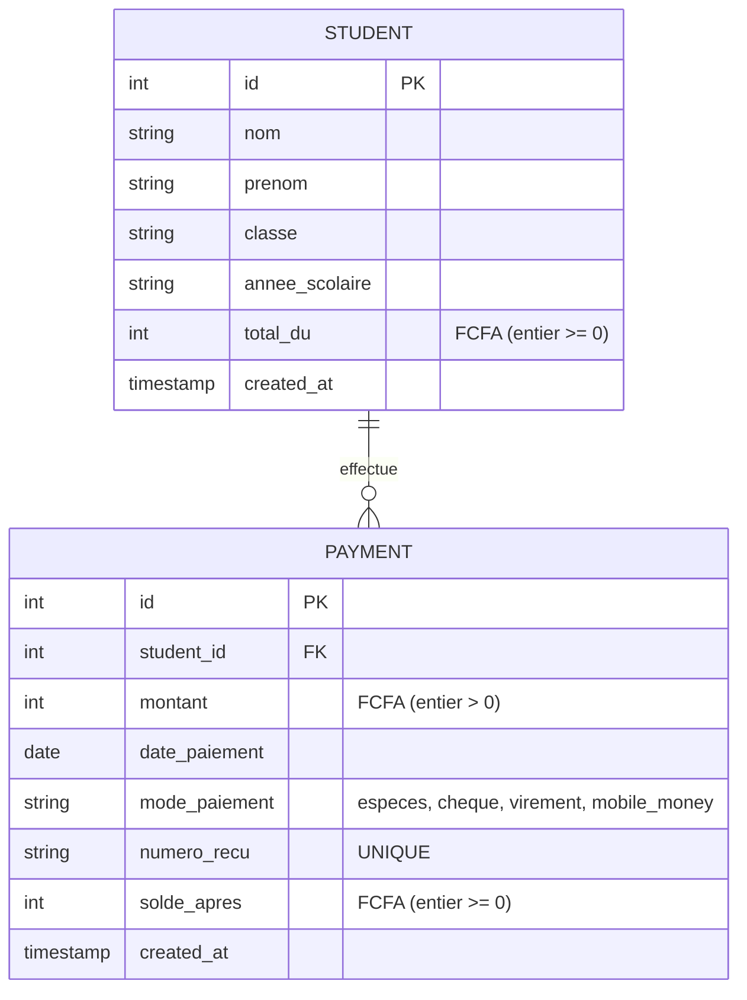

# Modèle Conceptuel de Données (MCD) - EduPaie

## MCD (Mermaid)

## MLD (Modèle Logique de Données)

### Table `students`

| Colonne | Type | Contraintes | Description |
|---------|------|-------------|-------------|
| id | INTEGER | PRIMARY KEY AUTOINCREMENT | Identifiant unique de l'élève |
| nom | TEXT | NOT NULL | Nom de l'élève |
| prenom | TEXT | NOT NULL | Prénom de l'élève |
| classe | TEXT | NOT NULL | Classe (ex: 6ème A, 5ème B) |
| annee_scolaire | TEXT | NOT NULL | Année scolaire (ex: 2025-2026) |
| total_du | INTEGER | NOT NULL, CHECK >= 0 | Montant total dû en FCFA (entier) |
| created_at | TIMESTAMP | DEFAULT CURRENT_TIMESTAMP | Date de création de l'enregistrement |

### Table `payments`

| Colonne | Type | Contraintes | Description |
|---------|------|-------------|-------------|
| id | INTEGER | PRIMARY KEY AUTOINCREMENT | Identifiant unique du paiement |
| student_id | INTEGER | NOT NULL, FK students(id) ON DELETE RESTRICT | Référence à l'élève |
| montant | INTEGER | NOT NULL, CHECK > 0 | Montant payé en FCFA (entier positif) |
| date_paiement | TEXT | NOT NULL | Date du paiement (format YYYY-MM-DD) |
| mode_paiement | TEXT | NOT NULL, CHECK IN ('especes','cheque','virement','mobile_money') | Mode de paiement |
| numero_recu | TEXT | UNIQUE, NOT NULL | Numéro unique du reçu (ex: REC-2025-000001) |
| solde_apres | INTEGER | NOT NULL, CHECK >= 0 | Solde restant après ce paiement (figé) |
| created_at | TIMESTAMP | DEFAULT CURRENT_TIMESTAMP | Date de création de l'enregistrement |

## Index

- `idx_payments_student_id` sur `payments(student_id)` : optimise les requêtes de paiements par élève
- `idx_payments_numero_recu` sur `payments(numero_recu)` : optimise la recherche par numéro de reçu
- `idx_students_classe` sur `students(classe)` : optimise le filtrage par classe

## Règles de gestion

1. **Devise** : Tous les montants sont en FCFA, stockés comme entiers (pas de décimales).
2. **Solde calculé** : `solde = total_du - SUM(payments.montant)`
3. **Solde figé** : Le champ `solde_apres` dans `payments` est figé au moment du paiement et ne change jamais.
4. **Suppression** : Un élève avec des paiements ne peut pas être supprimé (ON DELETE RESTRICT).
5. **Numéro de reçu** : Doit être unique et généré de façon atomique avec l'insertion du paiement.
6. **Montant** : Doit être strictement positif et ne peut pas dépasser le solde restant.
